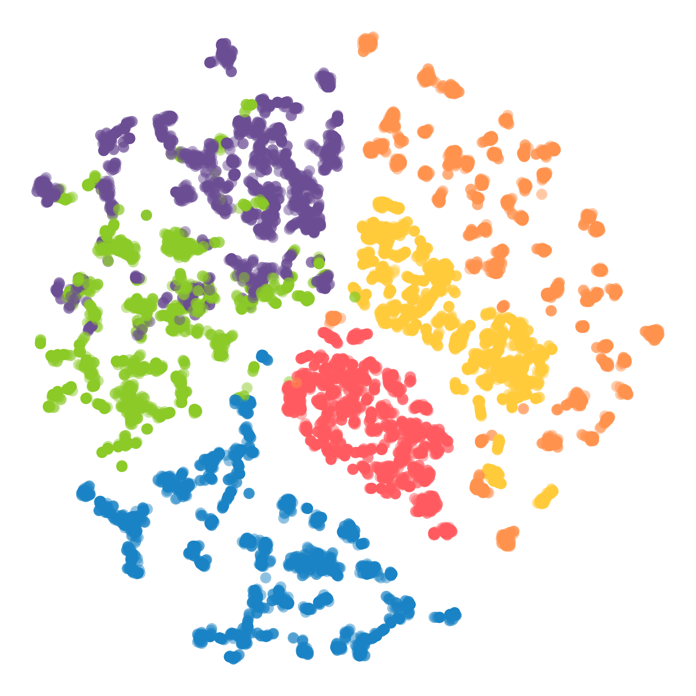

# Multi-task Self-Supervised Methods for Label-Efficient Learning

This repository contains the codebase for my Master's thesis on multi-task self-supervised learning (SSL) methods for label-efficient learning (TODO: link to pdf). The goal is to leverage self-supervised learning combined with multi-task learning techniques to improve the efficiency and effectiveness of learning from limited labeled data.

---

### 🎯 Quick summary
- Combine contrastive objectives and pretext tasks in a modular multitask SSL framework.
- Dynamic task weighting to balance heterogeneous loss scales.
- Precomputed augmentations and masked inputs for fast multi-task training.
- Centralized and federated training utilities and checkpoints for privacy-aware workflows.


*Figure 1: Overview of the modular multi-task self-supervised learning (SSL) framework combining contrastive and pretext objectives with dynamic task weighting.*

---

### 📁 Project layout
- [common/](common/) — shared modules (encoders, losses, model definitions, utilities)
- [data/](data/) — dataset storage & download helpers (UCI HAR, STL-10)
- [data_processing/](data_processing/) — augmentations, precomputation and dataloaders
- [HAR_centralized/](HAR_centralized/) — centralized experiments on HAR, configs and training entrypoints
- [HAR_federated/](HAR_federated/) — federated prototype to train encoders (server / client orchestration)
- [IR_centralized/](IR_centralized/) — preliminary image-based experiments (STL-10)
- packaging & meta: [setup.py](setup.py), [requirements.txt](requirements.txt), [LICENSE](LICENSE)

---

### 🚀 Quick start

#### 1. Setup environment (tested on Python 3.9+):
```sh
# language: sh
python -m venv .venv
source .venv/bin/activate
pip install -r requirements.txt
```


#### 2. Download the data:
- UCI HAR: run [data/download_uci_har.sh](data/download_uci_har.sh) to download the HAR dataset.
- (Optional) STL-10: use [data/download_stl10.py](data/download_stl10.py) to download the Image Recognition dataset (not needed, in case missing, data will be downloaded automatically on the fly).

#### 3. Configure experiment:
Each experiment has a custom config file that can be edited or parameters can be passed as command line flags when starting the training script.
For example:
```sh
python HAR_centralized/train_encoder.py --seed 42 --experiment_name my_experiment_name
```
To reproduce the experiments, there is no need to set any custom parameters, as the default values in the config files will be used. The `experiment_name` can be used to differentiate between different runs, and, together with the seed and information on the model heads active, it will be used for saving models and results.

#### 4. Run the experiments:

HAR experiments will produce models with pre-trained encoders:
- centralized training: `python HAR_centralized/train_encoder.py` (entrypoint: [HAR_centralized/train_encoder.py](HAR_centralized/train_encoder.py))
- federated training: `python HAR_federated/run.py` (entrypoint: [HAR_federated/run.py](HAR_federated/run.py))

These encoders can be used for downstream tasks on the actual HAR task:
`python HAR_centralized/train_classifier.py`

IR experiments work in the same way:
- pretraining: `python IR_centralized/train_encoder.py` (entrypoint: [IR_centralized/train_encoder.py](IR_centralized/train_encoder.py))
- downstream training: `python IR_centralized/train_classifier.py` (entrypoint: [IR_centralized/train_classifier.py](IR_centralized/train_classifier.py))

---

### 🧭 Tips & configuration
- Toggle pretraining heads with MODEL_HEADS in [HAR_centralized/config.py](HAR_centralized/config.py) or by passing command line arguments (order: augmentation classification, reconstruction, contrastive, features).
- Enable dynamic weighting via USE_WEIGHTED_LOSS in config; weights are created/managed in the training entrypoint.
- Check OUTPUT_DIR in [HAR_centralized/config.py](HAR_centralized/config.py) for where logs and checkpoints are written (default: HAR_centralized/outputs/).

---

### 📈 Results 

#### 1. Multi-Task Learning outperforms Single-Task Self-Supervised Learning


*Multi-Task Learning (MTL) significantly outperforms Single-Task Learning methods in self-supervised settings across all labeled-data regimes.*

#### 2. Multi-Task Self-Supervised Learning produces compact and robust representations, even better than those obtained with expert knowledge

<p align="center">
  
  
  
  
</p>
*The t-SNE visualizations of different data representations (each with a different size): raw signals (1,161), expert features (561), and MTL embeddings (128).*

#### 3. Federated Learning with Multi-Task Self-Supervised Learning is possible

*When trained in a federated setting, Multi-Task Self-Supervised Learning can still achieve competitive performance compared to centralized training. This allows for the utilization of massive decentralized data sources to create robust models while preserving data privacy and security.*

---

### 🧾 License & citation
This project is licensed under the MIT License - see the [LICENSE](LICENSE) file for details.
Please cite the following if you use this code in your research:
```bibtex
@mastersthesis{gobbetti:2025:MTSSL,
  title = {Multi-Task Self-Supervised Methods for Label-Efficient Learning},
  author = {Gobbetti, Alessandro},
  school = {Università della Svizzera italiana},
  year = {2025},
  type = {Master's Thesis},
  address = {Lugano, Switzerland}
}
```
